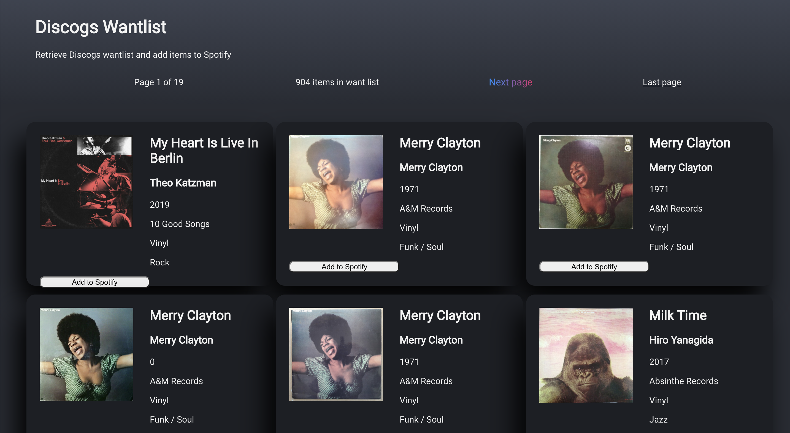

# Discogs/Spotify playlist creator

This app was created as weekend homework for week 7 of CodeClan. The objective was to create a React app that would dynamically render data fetched from an API. I extended the scope to also research and use sending to an API and using APIs that required authorisation.

The app fetches a user's wantlist from the record catalogue Discogs.com, renders the album information and image thumbnail in a card format, and adds a button to create a Spotify playlist for that album (if the album is found on Spotify).

## Usage

* Download/clone this repository
* Run `npm install`
* You will need a personal access token from your account on discogs.com, and a spotify API key.
* For the Spotify API key, you will need to make sure the `playlist-modify-private` and `playlist-modify-public` scopes are enabled for your key (https://developer.spotify.com/console/post-playlist-tracks/?playlist_id=&position=&uris=)
* In the ./src folder, rename auth.js.template to auth.js and insert the required information
* Run `npm start`
* Browse to the site at http://localhost:3000

## Future refinements/fixes

As I only had a weekend to complete this project, I had several more features and improvements I wanted to add but didn't have time for. It's not a particularly useful app, but it's good to practice on!

* Currently Spotify search just searches by album name, which can be ambiguous. Better solution would be to list all albums by an artist, then filter those results to find the correct album.
* Tidy, fix, improve CSS - make the header horizontal and fix so it in place so pagination options always accessible, make cards and animations neater. Possibly experiment with Tailwinds.
* Integrate React drag and drop - perhaps drag an album's image onto the header bar to add that album to Spotify? 
* Use Async Await with fetch to practice more modern syntax

